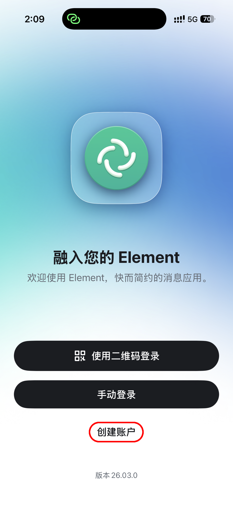
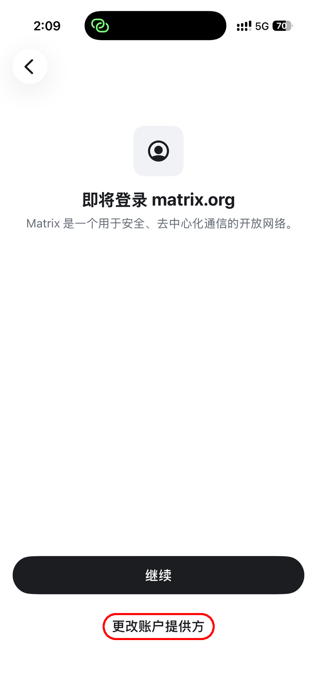
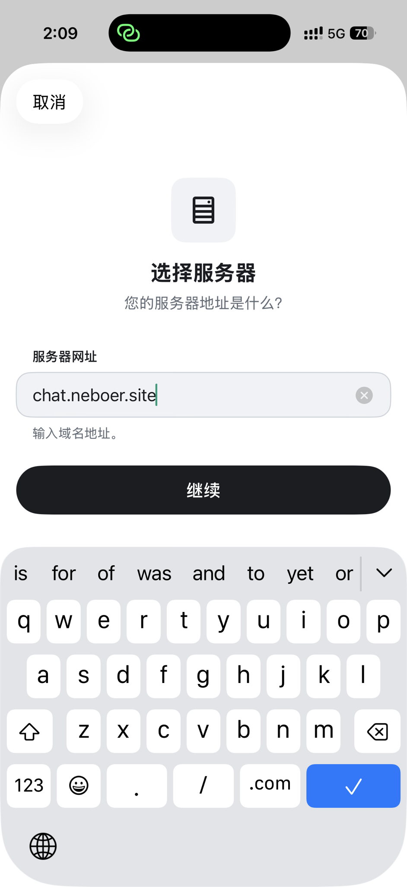

<!-- markdownlint-disable MD026 -->
# 使用ElementX连接NerChat!
<!-- markdownlint-enable MD026 -->

<!-- markdownlint-disable MD033 -->

  
  
  

<!-- markdownlint-enable MD033 -->

打开ElementX应用

选择 `手动登录`

选择 `更改账户提供方`

在服务器地址一栏输入 `chat.neboer.site`

点击 `继续` 后跟随引导输入账号密码完成登录流程即可连接到NerChat!。
