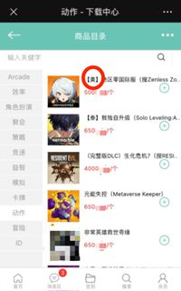
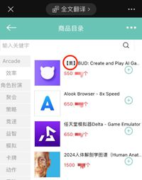
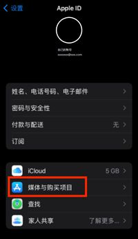
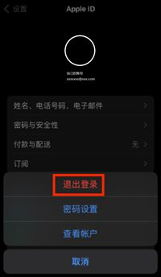
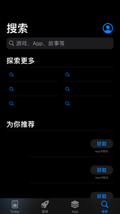
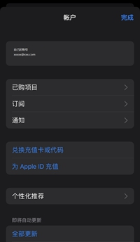
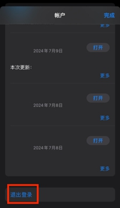

# IOS设备指南

IOS系统里安装软件并不容易。我们希望通过这个教程，给出一个可以在中国大陆安全、合法的安装官方Element客户端，并指定NerChat!作为目标服务器的操作指南。

::: warning

本指南不一定100%可行，随着IOS系统的更新，界面可能会有所改变，教程中的方法也可能会过期，NerChat!的维护团队不保证此内容的真实和有效性。本指南中的第三方平台与我们皆没有任何关系，我们也不进行任何宣传、广告建议。购买账号等相关的安全风险希望大家提前知悉。NerChat!本身不对给您造成的任何直接或间接的损失负任何责任。

:::

## 创建或获取美区账号

### 1. 借用账号

最简便的方法是借用美国亲友的美区Apple ID。此方法安全且高效，避免了账户被锁定的风险。

### 2. 购买账号

通过第三方平台获取美区Apple ID。许多微信公众号提供外区游戏的下载服务，可以通过其平台获得账号。具体步骤如下：

1. 关注相关微信公众号。
2. 按照公众号指示，注册并登录平台。
3. 通过平台购买或兑换美区Apple ID账号和密码。

  
  

平台内金币非人民币，注册时通常会赠送一定数量，充值费用较低。选择标注为“美区”的游戏进行兑换，获取账号和密码。

### 3. 注册美区账号

注册一个美区Apple ID，虽然相对麻烦，但最为安全。详细步骤请参考[此教程](https://zhuanlan.zhihu.com/p/367821925)。

## 安全登录App Store

::: danger

在获取账号和密码后，应谨慎操作，以防止因登录他人账户而导致设备被锁定的风险。为避免这种情况，建议仅在App Store中登录此账户，而不在整个设备中登录。此方法能有效避免设备被恶意锁定，确保操作的安全性。

:::

具体操作如下：（二选一）

::: tabs

== 方法一

### 在设置中登录

1. 打开“设置”应用。
2. 点击“媒体与购买项目”。
3. 选择“退出登录”。
4. 使用美区账号和密码登录“媒体与购买项目”。

  
  

== 方法二

### 在App Store中登录

1. 打开App Store应用。
2. 点击右上角的头像图标。
3. 滑动至页面底部，选择“退出登录”。
4. 使用美区账号和密码登录。

  
  
  

:::

## 下载Element应用

使用美区账号登录后，在App Store中搜索并下载Element应用。确认应用图标如下：

::: warning

下载完成后，立即退出美区账号并重新登录自己的Apple ID。

:::

## 使用NerChat!

打开Element应用，在“你的对话发生的地方”一栏填写“chat.neboer.site”，然后进行登录。

### 注意事项

初次登录时可能会遇到网络连接问题，建议在网络畅通的环境中进行登录（如出国旅游时）。成功登录后，应用不需要频繁更新，通知设置可在系统设置中调整。通过美区账号下载的软件在退出美区账号后依然可正常使用，但在登录其他账号时无法进行更新。