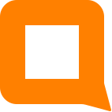

# 其他客户端

如果您不想使用Neboer修改的客户端，您当然可以使用其他客户端连接NerChat!，是完全没有问题的。只不过很多国外的客户端的下载比较麻烦，您可以选择Fdroid或Google Play两种不同的渠道安装，当然您需要自行解决连接问题。

::: info

如果您有能力解决连接问题，NerChat!欢迎并推荐您使用其他客户端。希望您能通过使用开源软件来积极支持开源软件的发展。

:::

## Element Android

首次打开Element是比较困难的，因为Element会默认连接matrix.org，需要一定的手段强制其使用代理才能在中国正常使用这个软件。

打开后，和Element的操作完全相同，点击“编辑”打开修改主服务器的窗口，然后添加新的主服务器“https://chat.neboer.site”。

输入账号密码，点击登录，便完成了整个登录的过程。

## IOS

关于IOS，请参考[IOS设备指南](ios-instructions)一章。

## Matrix官网上的其他推荐客户端

The Matrix ecosystem is vibrant. Whatever platform you use, someone has probably
already developed a client for it.

Featured clients
----------------

Clients are needed to chat using Matrix. Here is a selection of the most
mature ones you can safely use.

  
  <h3>FluffyChat</h3>

Cute instant messaging app for all platforms.

<Badge type="tip" text="iOS" />
<Badge type="tip" text="Android" />
<Badge type="tip" text="Linux" />
<Badge type="tip" text="Web" />

  
  <h3>Element X</h3>

Element X is pioneering the Matrix 2\.0 implementation, notably supporting fast sync with sliding sync.

<Badge type="tip" text="iOS" />
<Badge type="tip" text="Android" />

  
  <h3>Nheko</h3>

Desktop client for Matrix using Qt and C\+\+20\.

<Badge type="tip" text="Windows" />
<Badge type="tip" text="macOS" />
<Badge type="tip" text="Linux" />

  
  <h3>Cinny</h3>

A Matrix client focusing primarily on simple, elegant and secure interface.

<Badge type="tip" text="Windows" />
<Badge type="tip" text="macOS" />
<Badge type="tip" text="Linux" />
<Badge type="tip" text="Web" />

  
  <h3>Element</h3>

Element is a glossy client with an emphasis on performance and usability.

<Badge type="tip" text="iOS" />
<Badge type="tip" text="Android" />
<Badge type="tip" text="Windows" />
<Badge type="tip" text="macOS" />
<Badge type="tip" text="Linux" />
<Badge type="tip" text="Web" />

All known clients
-----------------

Here we list all the clients the Foundation is aware of, with a maturity
score and a list of important features they support or not to help you
pick the best for you.

  
  <h3>Hydrogen</h3>

Lightweight matrix client with legacy and mobile browser support.

<Badge type="tip" text="Web" />

  
  <h3>FluffyChat</h3>

Cute instant messaging app for all platforms.

<Badge type="tip" text="iOS" />
<Badge type="tip" text="Android" />
<Badge type="tip" text="Linux" />
<Badge type="tip" text="Web" />

  
  <h3>gotktrix</h3>

Matrix client in Go and GTK4\.

<Badge type="tip" text="Linux" />

  
  <h3>Element X</h3>

Element X is pioneering the Matrix 2\.0 implementation, notably supporting fast sync with sliding sync.

<Badge type="tip" text="iOS" />
<Badge type="tip" text="Android" />

  
  <h3>chatrix</h3>

Matrix client for WordPress.

<Badge type="tip" text="Web" />

  
  <h3>iamb</h3>

A terminal\-based Matrix client with Vim keybindings written in Rust.

<Badge type="tip" text="Windows" />
<Badge type="tip" text="macOS" />
<Badge type="tip" text="Linux" />

  
  <h3>Nheko</h3>

Desktop client for Matrix using Qt and C\+\+20\.

<Badge type="tip" text="Windows" />
<Badge type="tip" text="macOS" />
<Badge type="tip" text="Linux" />

  
  <h3>kazv</h3>

A convergent Matrix client and secure messaging app

<Badge type="tip" text="Windows" />
<Badge type="tip" text="Linux" />

  
  <h3>Thunderbird</h3>

A free open\-repo email, calendar \& chat app

<Badge type="tip" text="Windows" />
<Badge type="tip" text="macOS" />
<Badge type="tip" text="Linux" />

  
  <h3>Quadrix</h3>

Minimal Matrix client available in all main app stores

<Badge type="tip" text="iOS" />
<Badge type="tip" text="Android" />
<Badge type="tip" text="Windows" />
<Badge type="tip" text="macOS" />
<Badge type="tip" text="Linux" />
<Badge type="tip" text="Web" />

  
  <h3>Cinny</h3>

A Matrix client focusing primarily on simple, elegant and secure interface.

<Badge type="tip" text="Windows" />
<Badge type="tip" text="macOS" />
<Badge type="tip" text="Linux" />
<Badge type="tip" text="Web" />

  
  <h3>gomuks</h3>

A terminal Matrix client written in Go.

<Badge type="tip" text="macOS" />
<Badge type="tip" text="Linux" />

  
  <h3>Fractal</h3>

A Matrix messaging app for GNOME, written in Rust. Its interface is optimized for collaboration in large groups, such as free software projects, and will fit all screens, big or small.

<Badge type="tip" text="Linux" />

  
  <h3>chatty</h3>

A simple to use messaging app for 1:1 communication and small groups supporting
SMS, MMS, matrix and XMPP through libpurple.

<Badge type="tip" text="Linux" />

  
  <h3>Element</h3>

Element is a glossy client with an emphasis on performance and usability.

<Badge type="tip" text="iOS" />
<Badge type="tip" text="Android" />
<Badge type="tip" text="Windows" />
<Badge type="tip" text="macOS" />
<Badge type="tip" text="Linux" />
<Badge type="tip" text="Web" />

  
  <h3>Watch The Matrix</h3>

A Matrix client for watchOS written in Swift

  
  <h3>matrix\-commander</h3>

Simple but convenient CLI\-based Matrix client app for sending and receiving.

<Badge type="tip" text="Linux" />

  
  <h3>SchildiChat</h3>

Based on Element, with a more traditional instant messaging experience.

<Badge type="tip" text="Android" />
<Badge type="tip" text="Windows" />
<Badge type="tip" text="macOS" />
<Badge type="tip" text="Linux" />
<Badge type="tip" text="Web" />

  
  <h3>mnotify</h3>

A matrix cli client

<Badge type="tip" text="Linux" />

  
  <h3>NeoChat</h3>

A Matrix client for desktop and mobile

<Badge type="tip" text="Windows" />
<Badge type="tip" text="macOS" />
<Badge type="tip" text="Linux" />

  
  <h3>Quaternion</h3>

A Qt5\-based IM client for Matrix.

<Badge type="tip" text="Windows" />
<Badge type="tip" text="macOS" />
<Badge type="tip" text="Linux" />

  
  <h3>Syphon</h3>

A privacy centric matrix client

<Badge type="tip" text="iOS" />
<Badge type="tip" text="Android" />
<Badge type="tip" text="Linux" />

  
  <h3>Commet</h3>

Focused on providing a feature rich experience while maintaining a simple interface

<Badge type="tip" text="Windows" />
<Badge type="tip" text="Linux" />
<Badge type="tip" text="Web" />

  
  <h3>Ement.el</h3>

Ement.el is a Matrix client for GNU Emacs, the text editor and Lisp environment (which runs on GNU/Linux, MacOS, and Windows, as well as other platforms). It aims to be simple, fast, featureful, and reliable, while integrating naturally with Emacs.

<Badge type="tip" text="Linux" />

