# 设备密钥与交叉认证

如果您对非对称加密有所耳闻，那么您一定知道非对称加密难以抵抗“中间人攻击”。Matrix也不例外暴露在这种攻击的威胁下。在TLS中，解决中间人攻击的措施和手段是由权威的第三方进行“公钥签名”，但Matrix协议中显然不能这么做。Matrix的信任模型中，您永远不能相信为您提供服务的服务器是可信的，如果服务器对您的客户端进行中间人攻击，可以轻易的介入您和对方的加密聊天，获得所有数据。

为了确保对方发送过来的公钥完全来源于对方而不是中间人，你们需要一个额外的、不受中间人控制的受信任的环境来对比密钥，比如QQ/微信聊天（这些渠道是否安全无所谓，只要不受Matrix系统管理员控制即可）。在Matrix中，你们可以通过在其他渠道里比对在双方生成的Emoji图片的顺序来完成整个确认过程。如果双方生成的图片顺序相同，就说明双方都是可以信任的，那么双方的设备就会互相为对方的密钥签名，承认其合法性。

## Matrix对中间人攻击的防御

任何用户的每个Matrix客户端都有且仅有一个密钥，当此密钥丢失或重置，Matrix系统会视当前用户正在使用一个新设备。
当每个用户的新设备登录Matrix的时候，会被要求使用已有的设备对新设备的密钥进行签名。这是为了防止两个潜在的威胁：

1. 账号密码泄露，被其他人假冒登录，或者被服务器管理员（已知您的密码）登录。
2. 服务器尝试对已有的设备进行中间人攻击，用服务器的中间人公钥替换你们交换给对方的公钥，尝试破解你们的消息。

如果您拒绝签名，或者确实是被第三方攻击，Element软件上会显示一个很大的红色感叹号图标，意为：此设备的密钥不受信任，有可能是中间人攻击。

所谓的设备签名密钥认证，就是使用您已有的设备密钥去签名新的设备的密钥，从而使自己的新设备密钥快速被自己的所有设备所信任。这种信任会随交叉认证传递给已经信任您其中一台设备的另一个用户的设备，进而不需要额外的认证过程，你就可以快速而安全的使用新设备与其他人聊天，其他人看来，您的新设备的认证状态就是已认证的，这和您手动认证的老设备无异。我们接下来会讲述这个认证的具体原理。

## 交叉认证原理

我们假设，网络中有AB两个用户，他们各自独立拥有两台设备，每个人的两台设备都是互相信任的设备，但两个用户之间没有建立其他的认证关系。

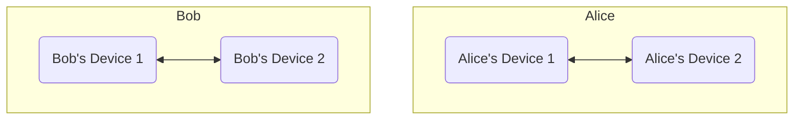

现在，Alice使用“Alice's Device 1”向Bob的“Bob's Device 2”聊天，两人交换了对应设备的公钥。但由于两人并没有进行任何的认证，因此双方都无法充分的信任对方发来的公钥。

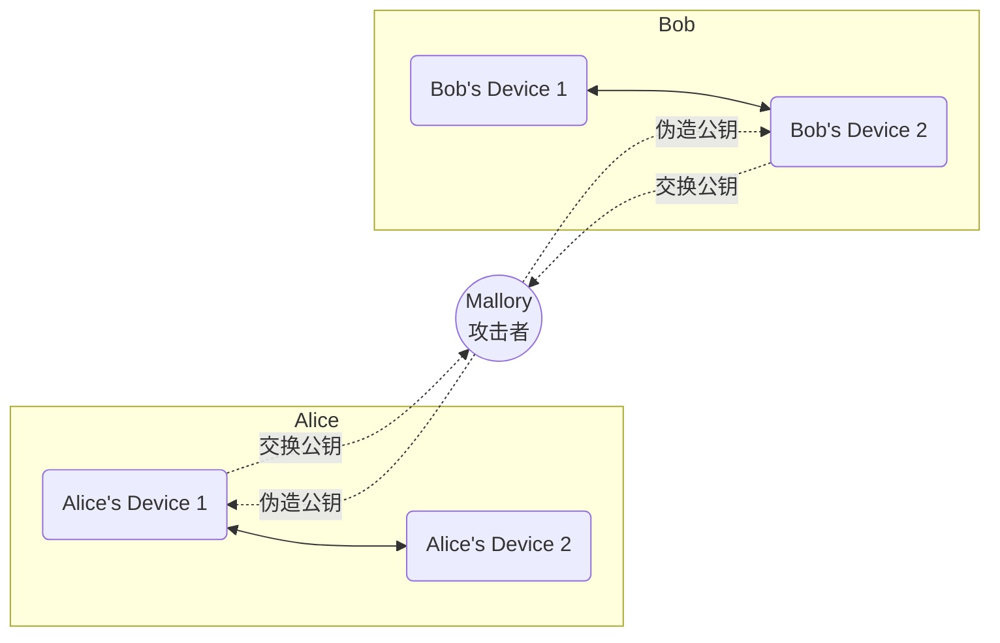

此时，在Alice和Bob的设备上看去，对方的加密图案是灰色的，意为该聊天可能不受信任。这个灰色的图案是Matrix服务器提供的保证，Matrix服务器告诉双方，双方的设备都经过各自独立的签名，不过因为这只是服务器的一面之词，你还没有验证这一点，所以Element非常保守的选择了灰色的图标。如果有用户的设备还没有经过其他设备的签名，Matrix服务器会警告客户端，Element则会显示一个红色的感叹号图标。

无论是灰色还是红色，都不是好的颜色，因此Alice向Bob提出进行[密钥交换](cryptology#%E8%BF%AA%E8%8F%B2-%E8%B5%AB%E5%B0%94%E6%9B%BC%E5%AF%86%E9%92%A5%E4%BA%A4%E6%8D%A2)，以确认对方发来的公钥和对方设备公钥是一致的。密钥交换实际发生在一个不受Matrix系统控制的第三方环境中，比如QQ微信，或者其他Matrix服务器（比如官方服务器）。

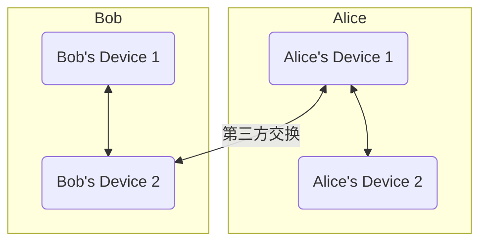

他们经过交换，确认对方发来的公钥就是他们自己的公钥，因此彻底证实了对方设备的安全性，因此双方的设备之一就互相信任了。

两个设备之间的信任关系，可以传递到对方的所有设备中，因此Bob's Device 2和Alice's Device 2进行通信的时候，也可以直接通过Bob's Device 2和Alice's Device 1建立的信任关系而间接互相信任，从此Alice和Bob就不再需要进行第三方密钥交换，可以自然信任所有对方的新设备和旧设备了。

未来，Bob添加了新设备Bob's Device 3，并与Bob's Device 1互相信任，此时Bob's Device 3和Alice's Device 2的聊天也可以通过Bob's Device 2和Alice's Device 1建立的信任关系而间接互相信任。

以下示意图说明了这一点，图中实线部分是已经确定建立的信任关系，虚线部分表达了Bob's Device 3和Alice's Device 2建立的对话可以直接通过实线部分的信任链信任。这就是交叉信任的原理和目的。
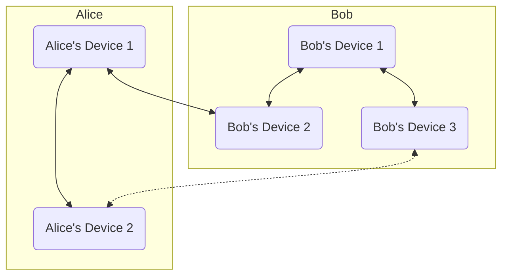

## 交叉认证方法

如果你想认证一个人的设备，你至少需要拥有自己的Megolm密钥库，所以需要先提供安全密钥验证自己的设备。关于验证设备的方法请参考[导入安全密钥](secure-key#加载安全密钥)。当你想验证一个用户的时候，请确保自己和这个用户有除了NerChat!之外的第二个通信渠道，比如电子邮件、其他的社交平台、或者一个稳定的视频连接，当然最推荐的是线下直接见面，这个渠道被用来分享自己的emoji表情，和对方比对是否一致。

::: tabs

== Web

在你和要验证的用户的聊天中点击那个人的头像，可以看到他的所有设备及其验证情况。标记为绿色的设备是经过验证的设备，标记为灰色的是没有经过您的但是经过其他人验证的设备，标记为红色的是没有经过任何人验证的设备，是不可信任的设备。

- 您可以点击聊天室的“验证”按钮，申请进行迪菲-赫尔曼密钥交换，并基于此次交换的结果重新开始双棘轮加密过程，您之前的密钥依然会保存在密码库中，作为解密历史消息的手段。

    1. 点击聊天信息按钮，在菜单里点击“验证”。

        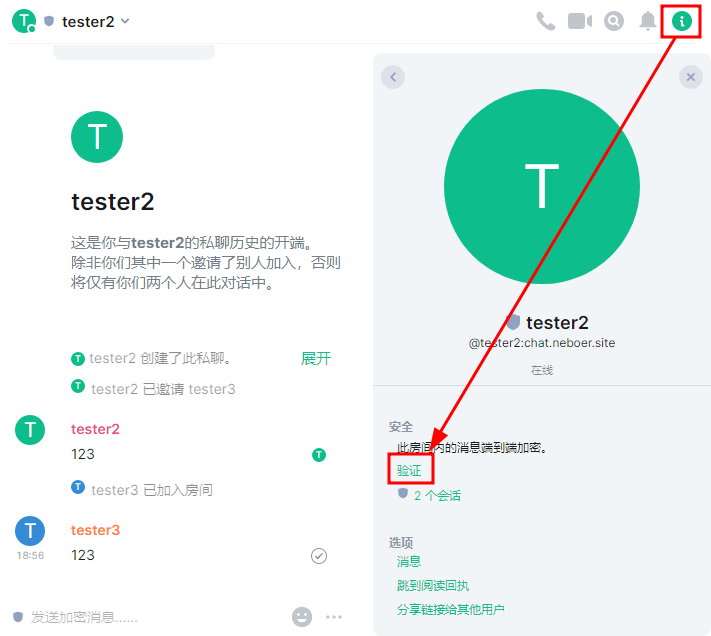
    
    2. 点击“开始验证”开始两个人的验证过程。您此时最好已经做好和对方用另一种方式聊天的准备。

        

          
          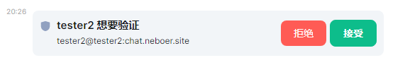
        

        您可以“接受”弹出的“已请求验证”通知，也可以点击聊天记录里出现的“想要验证”消息的“接受“按钮来接受验证，两种方法是一样的。

    3. 两人中的任何一方都可以主动点击“通过表情符号验证”按钮发起验证。

        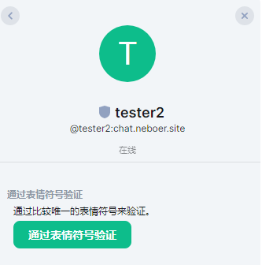
    
    4. 通过可靠渠道比对二人生成的emoji表情序列，看看他们是否相同。如果相同，则说明会话安全，没有中间人，验证通过，可以用这个临时建立的可信加密通道交换公钥了。如果不同……放心不可能不同的。NerChat!绝对安全，同时我们对您的加密聊天内容完全不感兴趣，不会进行中间人攻击，您永远可以信任我们的服务器。

        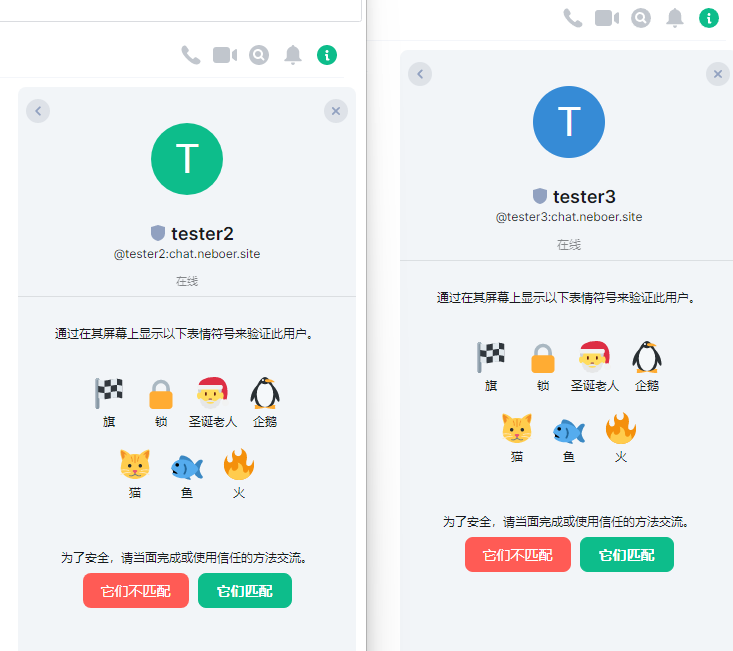

    5. 两人均点击“他们匹配”之后，整个验证流程就结束了。

    验证结束之后，一个可靠的加密通道就顺利建立起来了。两人会用这个通道建立一个临时的连接，交换公钥互相签名认证对方的身份，以后的聊天就可以通过这个可信的密钥进行了。

- 您还可以点击灰色或红色的设备，然后在窗口中选择“文本”或者“emoji”以开始验证对方的某个设备，验证流程如下。

    1. 点击聊天信息按钮，在菜单里点击对方的头像，在对方的信息页面里点击“x个会话”，展开设备列表。选择一个灰色或红色的设备来开始验证。

        

          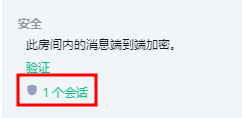
          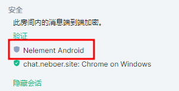
        

    2. 在弹出的对话中选择“以文本形式验证”或“以emoji形式验证”二者的原理相同，不过比起emoji，文本在互联网上的传输更加容易一些。

== Mobile

在移动端，您可以验证一个加密聊天的安全性，方法和Web端相似。

1. 在聊天列表中，打开与一个人的聊天对话窗口，点击顶部头像栏，打开聊天信息窗口。

    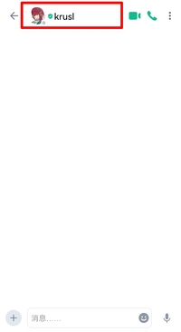
    

2. 下拉菜单，找到“2人”选项，点击查看房间的全部成员。

    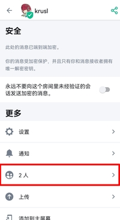

3. 在成员中点击你想要验证的人，打开他的个人信息详情页面。

    

        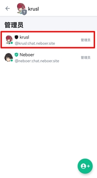
        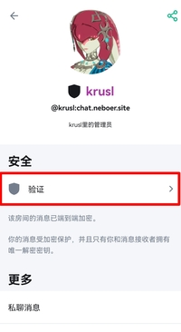
    

4. 点击“验证”按钮，开始你们之间的验证流程。

    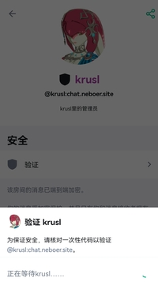

    此时，另一个人会在聊天栏里看到验证请求，同时还会收到消息推送。

    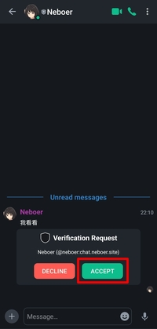

    另一个人点击“接受”。

5. 选择一种验证方式，这里选择emoji方法。当然您也可以点击二维码验证方法，去拍摄另一人设备上出现的二维码。

    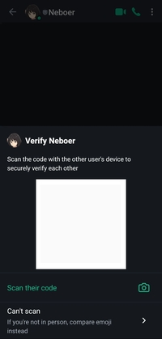

    点击emoji方法之后，会弹出一些emoji图标，请在一个受信任的环境中和对方比对你们设备上的emoji符号是否一致。
    
    

        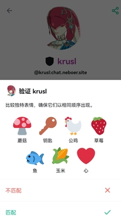
        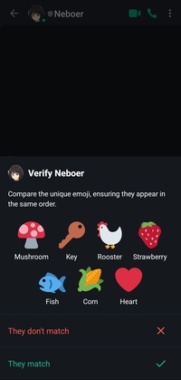
    

6. 如果emoji序列相同，则说明会话安全，没有中间人，验证通过，可以用这个临时建立的可信加密通道交换公钥了。如果不同……放心不可能不同的。NerChat!绝对安全，同时我们对您的加密聊天内容完全不感兴趣，不会进行中间人攻击，您永远可以信任我们的服务器。

    当emoji验证完成之后，点击“匹配”，完成验证过程。

    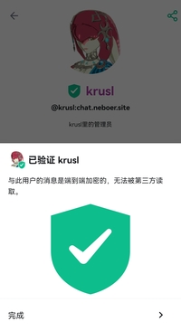

7. 验证完成之后，您可以看到对方的设备图标已经变成了绿色的盾牌，说明对方的现在的设备公钥包含了您自己的签名，是完全可以信任的。现在，一个可靠的加密聊天通道已经建立，你们可以进行完全可信的安全加密聊天过程了。

    

        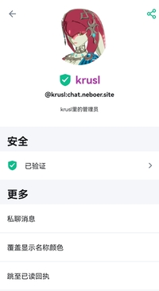
        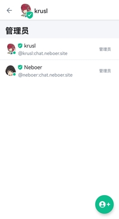
    

:::

设备认证的过程非常复杂，但它是非对称加密方法的固有限制。设备验证彻底保证了有且仅有和你聊天的对方能看到你的消息并给你发送消息，从而保证了您聊天的安全性。
如果您追求极致安全，请检查一个聊天室中是否所有的用户都已经持有绿色盾牌，如果是，则聊天的过程完全可信，服务器没有从中做梗的可能，有关这一问题的详细讨论，请参考[威胁模型](device-and-secret#威胁模型)。

可以说，这个公钥认证体系在服务器中建立了一套可信的CA体系，您可以通过这套体系以最少的验证次数验证最多的用户设备。

::: danger

不要轻易重置自己的密钥。一旦密钥重置，所有包含您在内的信任链将会被摧毁，很多用户不得不重新开始验证过程才能互相确认彼此聊天的安全。

:::

::: danger

不要轻易同意一个人的验证请求，尤其是当您和他完全不认识或者完全没有第二个互相认证信息的渠道的时候。轻易的建立起不一定安全的验证是对自己的签名的滥用，会危害整个服务器的信任体系。所以遇到不明的验证请求请拒绝。

**如果您从未认证过自己不信任的设备，同时您相信您认证的设备的持有者也不会认证自己不信任的设备，那么您完全可以相信绿色盾牌——你们的聊天加密是可靠的。**

:::

## 否认交叉签名的有效性

如果您从未认证过自己不信任的设备，同时您相信您认证的设备的持有者也不会认证自己不信任的设备，那么您完全可以相信绿色盾牌——你们的聊天加密是可靠的，但如果您不信任呢？您当然可以不信任他们！对于这种情况，您可以直接关闭对交叉验证的信任，只选择信任自己亲自验证过的密钥和设备。打开这个选项后，您将不再信任所有不是您亲自验证的设备，您必须手动一一验证所有您加入的加密聊天的所有成员的公钥。

::: tabs

== Web

点击头像->所有设置->隐私安全->高级 加密 “手动验证所有远程会话”

== Mobile

移动端暂时没有实现该功能。

:::
