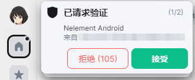
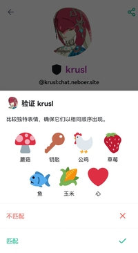
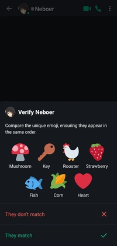
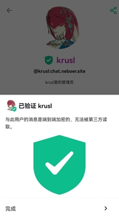
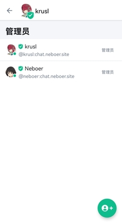

如果您对非对称加密有所耳闻，那么您一定知道非对称加密难以抵抗“中间人攻击”。Matrix也不例外暴露在这种攻击的威胁下。在TLS中，解决中间人攻击的措施和手段是由权威的第三方进行“公钥签名”，但Matrix协议中显然不能这么做。Matrix的信任模型中，您永远不能相信为您提供服务的服务器是可信的，如果服务器对您的客户端进行中间人攻击，可以轻易的介入您和对方的加密聊天，获得所有数据。

为了确保对方发送过来的公钥完全来源于对方而不是中间人，你们需要一个额外的、不受中间人控制的受信任的环境来对比密钥，比如QQ/微信聊天（这些渠道是否安全无所谓，只要不受Matrix系统管理员控制即可）。在Matrix中，你们可以通过在其他渠道里比对在双方生成的Emoji图片的顺序来完成整个确认过程。如果双方生成的图片顺序相同，就说明双方都是可以信任的，那么双方的设备就会互相为对方的密钥签名，承认其合法性。

## 密钥签名

不过，如果每个人都互相比对一遍和自己聊天的所有人的密钥，相当困难而且不现实。为了快速建立全服务器信任体系，Matrix引入了“交叉认证”机制。您A可以主动申请认证一个人B，通过另一个可靠的网络来验证B的合法性，并对B进行签名，下次B再向其他人C申请验证的时候，可以带上这个签名，如果C也信任签名者A（也就是您自己），那么C可以理所应当的信任B，这样BC就不需要重复AB的认证过程，可以建立起稳定的信任了。

NerChat!的服务端采用synapse部署，保证不会进行中间人攻击，不过为了保险起见，推荐大家还是互相认证一下。为了认证一个人的设备，需要用到“设备认证”功能，下面会详细介绍认证设备的方法，推荐大家掌握。

## 设备认证

如果你想认证一个人的设备，你至少需要拥有自己的Megolm密钥库，所以需要先提供安全密钥验证自己的设备。关于验证设备的方法请参考[导入安全密钥](secure_key/#加载安全密钥)。当你想验证一个用户的时候，请确保自己和这个用户有除了NerChat!之外的第二个通信渠道，比如电子邮件、其他的社交平台、或者一个稳定的视频连接，当然最推荐的是线下直接见面，这个渠道被用来分享自己的emoji表情，和对方比对是否一致。

::: tabs#client

@tab Web

在你和要验证的用户的聊天中点击那个人的头像，可以看到他的所有设备及其验证情况。标记为绿色的设备是经过验证的设备，标记为灰色的是没有经过您的但是经过其他人验证的设备，标记为红色的是没有经过任何人验证的设备，是不可信任的设备。

- 您可以点击聊天室的“验证”按钮，申请进行迪菲-赫尔曼密钥交换，并基于此次交换的结果重新开始双棘轮加密过程，您之前的密钥依然会保存在密码库中，作为解密历史消息的手段。

    1. 点击聊天信息按钮，在菜单里点击“验证”。

        
    
    2. 点击“开始验证”开始两个人的验证过程。您此时最好已经做好和对方用另一种方式聊天的准备。

        

        

        您可以“接受”弹出的“已请求验证”通知，也可以点击聊天记录里出现的“想要验证”消息的“接受“按钮来接受验证，两种方法是一样的。

    3. 两人中的任何一方都可以主动点击“通过表情符号验证”按钮发起验证。

        
    
    4. 通过可靠渠道比对二人生成的emoji表情序列，看看他们是否相同。如果相同，则说明会话安全，没有中间人，验证通过，可以用这个临时建立的可信加密通道交换公钥了。如果不同……放心不可能不同的。NerChat!绝对安全，同时我们对您的加密聊天内容完全不感兴趣，不会进行中间人攻击，您永远可以信任我们的服务器。

        

    5. 两人均点击“他们匹配”之后，整个验证流程就结束了。

    验证结束之后，一个可靠的加密通道就顺利建立起来了。两人会用这个通道建立一个临时的连接，交换公钥互相签名认证对方的身份，以后的聊天就可以通过这个可信的密钥进行了。

- 您还可以点击灰色或红色的设备，然后在窗口中选择“文本”或者“emoji”以开始验证对方的某个设备，验证流程如下。

    1. 点击聊天信息按钮，在菜单里点击对方的头像，在对方的信息页面里点击“x个会话”，展开设备列表。选择一个灰色或红色的设备来开始验证。

        

        

    2. 在弹出的对话中选择“以文本形式验证”或“以emoji形式验证”二者的原理相同，不过比起emoji，文本在互联网上的传输更加容易一些。

@tab Mobile

在移动端，您可以验证一个加密聊天的安全性，方法和Web端相似。

1. 在聊天列表中，打开与一个人的聊天对话窗口，点击顶部头像栏，打开聊天信息窗口。

    
    

2. 下拉菜单，找到“2人”选项，点击查看房间的全部成员。

    

3. 在成员中点击你想要验证的人，打开他的个人信息详情页面。

    
    

4. 点击“验证”按钮，开始你们之间的验证流程。

    

    此时，另一个人会在聊天栏里看到验证请求，同时还会收到消息推送。

    

    另一个人点击“接受”。

5. 选择一种验证方式，这里选择emoji方法。当然您也可以点击二维码验证方法，去拍摄另一人设备上出现的二维码。

    

    点击emoji方法之后，会弹出一些emoji图标，请在一个受信任的环境中和对方比对你们设备上的emoji符号是否一致。

    
    

6. 如果emoji序列相同，则说明会话安全，没有中间人，验证通过，可以用这个临时建立的可信加密通道交换公钥了。如果不同……放心不可能不同的。NerChat!绝对安全，同时我们对您的加密聊天内容完全不感兴趣，不会进行中间人攻击，您永远可以信任我们的服务器。

    当emoji验证完成之后，点击“匹配”，完成验证过程。

    

7. 验证完成之后，您可以看到对方的设备图标已经变成了绿色的盾牌，说明对方的现在的设备公钥包含了您自己的签名，是完全可以信任的。现在，一个可靠的加密聊天通道已经建立，你们可以进行完全可信的安全加密聊天过程了。

    
    

:::

设备认证的过程非常复杂，但它是非对称加密方法的固有限制。设备验证彻底保证了有且仅有和你聊天的对方能看到你的消息并给你发送消息，从而保证了您聊天的安全性。
如果您追求极致安全，请检查一个聊天室中是否所有的用户都已经持有绿色盾牌，如果是，则聊天的过程完全可信，服务器没有从中做梗的可能，有关这一问题的详细讨论，请参考[威胁模型](device_and_secret/#威胁模型)。

可以说，这个公钥认证体系在服务器中建立了一套可信的CA体系，您可以通过这套体系以最少的验证次数验证最多的用户设备。

::: danger

不要轻易重置自己的密钥。一旦密钥重置，所有包含您在内的信任链将会被摧毁，很多用户不得不重新开始验证过程才能互相确认彼此聊天的安全。

:::

::: danger

不要轻易同意一个人的验证请求，尤其是当您和他完全不认识或者完全没有第二个互相认证信息的渠道的时候。轻易的建立起不一定安全的验证是对自己的签名的滥用，会危害整个服务器的信任体系。所以遇到不明的验证请求请拒绝。

**如果您从未认证过自己不信任的设备，同时您相信您认证的设备的持有者也不会认证自己不信任的设备，那么您完全可以相信绿色盾牌——你们的聊天加密是可靠的。**

:::

## 否认交叉签名的有效性

如果您从未认证过自己不信任的设备，同时您相信您认证的设备的持有者也不会认证自己不信任的设备，那么您完全可以相信绿色盾牌——你们的聊天加密是可靠的，但如果您不信任呢？您当然可以不信任他们！对于这种情况，您可以直接关闭对交叉验证的信任，只选择信任自己亲自验证过的密钥和设备。打开这个选项后，您将不再信任所有不是您亲自验证的设备，您必须手动一一验证所有您加入的加密聊天的所有成员的公钥。

::: tabs#client

@tab Web

点击头像->所有设置->隐私安全->高级 加密 “手动验证所有远程会话”

@tab Mobile

移动端暂时没有实现该功能。

:::
