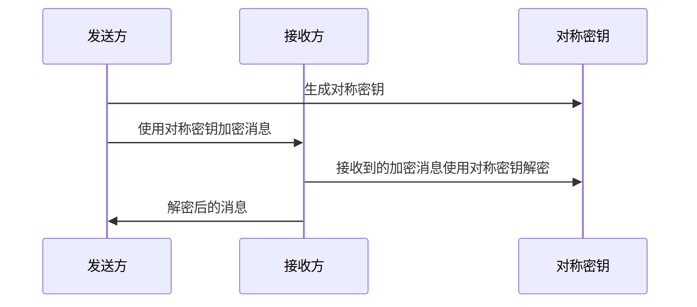
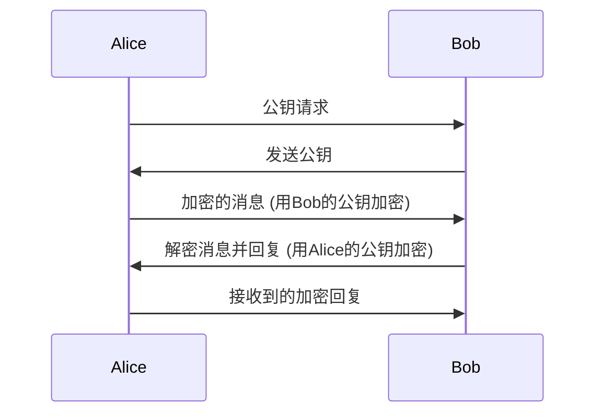
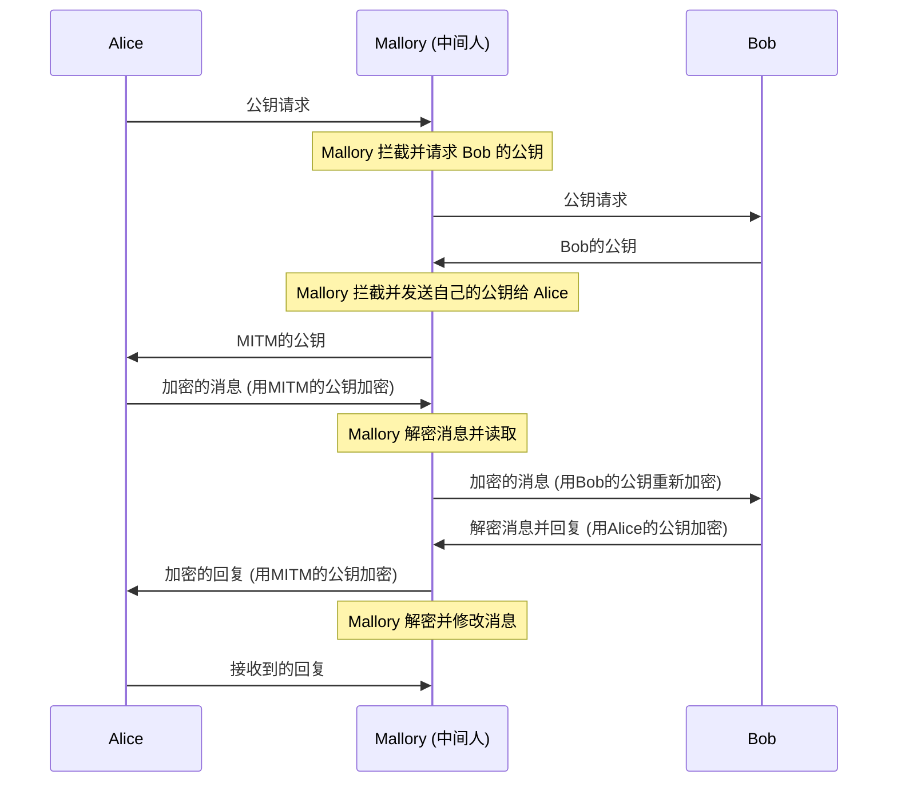
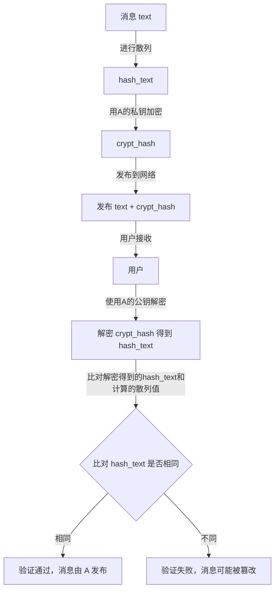
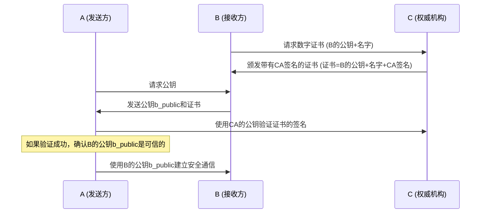
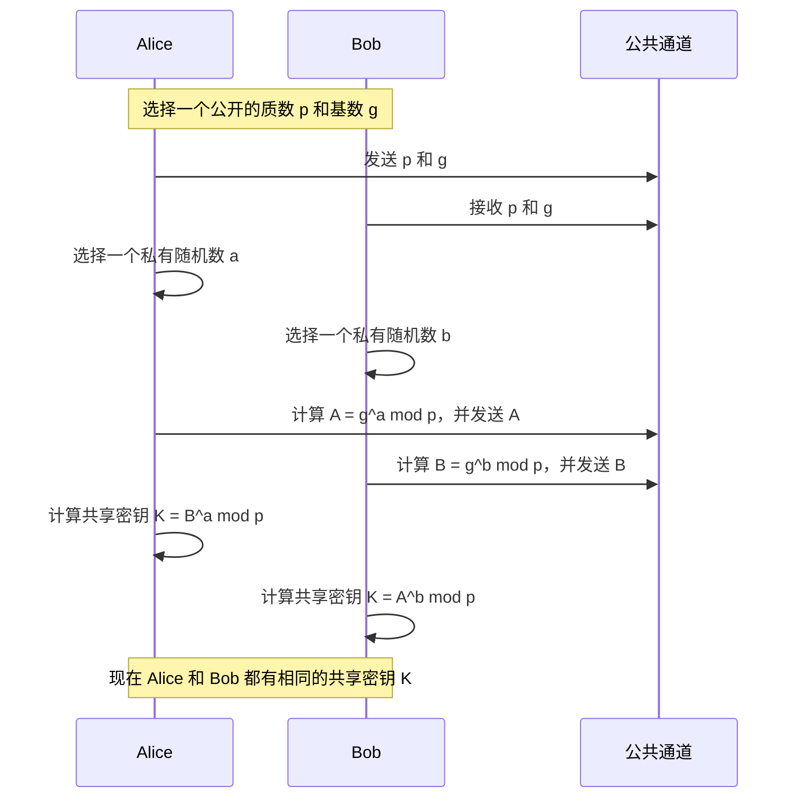

# 密码学综述

Matrix是一个严格加密的协议，本章会大概介绍Matrix加密协议的密码学背景知识，希望这些内容可以帮助读者更好的理解Matrix/Element的加密实现。

::: info

本文不是必看内容，但本文会尽量写得浅显易懂，推荐使用NerChat!的用户都对密码学有一定的基础了解，如果读者已经精通密码学，则没必要再看这篇错误和漏洞遍布的文章。

本文旨在让完全不了解密码学的新手速通密码学，所以会写得非常简略。

:::

## 对称加密

对称加密是最基础的算法，通过一个密码来加密一条消息形成密文，加密和解密使用同一个密码。

对称加密的成本低，但是安全性也低，密钥的作用很大。在Matrix中，对称加密最主要的作用是用来加密Megolm密钥库，上传到服务器备份。

如果对称加密的密钥被攻击者轻易获得，那么攻击者可以利用这个密钥任意解密加密消息，非常不安全。

## 非对称加密

非对称加密是加密解密分离的算法，消息双方都各自生成一对公钥和私钥，然后在网络中发布自己的公钥，而私钥则保留在自己的手中。
B可以利用A的公钥加密消息，将加密后的消息发送给A，A在收到消息后用自己的私钥解密消息内容，就获得了B的消息明文。
网络中的攻击者只能获得公钥和密文，无法解密消息本身，是非常聪明的加密算法。

但非对称加密可能会受到中间人攻击的威胁，这是一个很重要的问题，我们在下面给出详细的解释。

## 中间人攻击

中间人攻击是一种专门针对在无公钥认证体系的非对称加密系统的攻击。强大的网络的攻击者可以充当中间人，同时生成两对公私钥，一对用来和Alice通信，一对用来和Bob通信，如果Alice和Bob不对对方发送的公钥做任何的确认和检查，就直接默认信任，那么中间人攻击就成立了。中间人可以获得加密的所有内容，也可以任意修改其中的内容，发送给对端。

## 散列与签名

散列（hash）是一种摘要提取算法：通过某种特定的运算，让消息几乎唯一的对应一串字符序列，不同的消息对应不同的序列，相同的消息对应相同的序列。

在非对称加密中，如果A用自己的私钥加密了一段消息，任何人都可以用A发布的公钥解密消息的内容。
如果A发送了一段消息text，然后对消息进行散列得到hash_text，用自己的私钥加密hash_text，得到密文crypt_hash，然后向网络中发布text+crypt_hash，
知道A的公钥的用户可以用A的公钥解密crypt_hash，得到hash_text，然后比对hash_text是否真的为text的hash，如果相同，则说明了这份text是完全由A发布的，
因为只有A才有私钥来加密hash_text。

这个crypt_hash就被称为text的签名，它代表了您完全可以相信消息的作者是A。

## 证书、CA

中间人可能介入非对称加密的过程，让整个通信不再安全，我们迫切的希望有一种可靠的方法能够验证公钥的来源是可信的，而不是中间人。于是我们引入了数字证书的概念。

A想和B在不安全的网络里通信，B为了让A相信自己，去找了一家权威机构C，让他为自己的一些信息(B的公钥b_public+B的名字b_name)签名。A向B请求公钥的时候，B不但发送给A自己的公钥，而且还附带发送了权威机构C的签名。由于A相信权威机构C的私钥不会泄露，而且A知道B的名字是b_name，所以A利用机构公开发布的公钥验证了这个签名的合法性，确认了B的公钥是真正的B的公钥，于是就可以和他放心的用这个公钥建立通信了。

我们把(B的公钥b_public+B的名字b_name)称为C“颁发”给B的“证书”，权威机构C被称做“CA”。

## 交叉认证

交叉认证是一种通过信任链简化互认证过程的技术。具体参考[交叉认证](cross-sign)一章。

## 迪菲-赫尔曼密钥交换

迪菲-赫尔曼密钥交换（Diffie–Hellman key exchange，D-H）是一种安全协议。它可以让双方在完全没有对方任何预先信息的条件下通过不安全信道创建起一个密钥。这个密钥可以在后续的通讯中作为对称密钥来加密通讯内容。迪菲－赫尔曼通过公共信道交换一个信息，就可以创建一个可以用于在公共信道上安全通信的共享秘密。

举个例子：A和B希望在NerChat!中建立一个安全的通信渠道，两个人进行一次迪菲-赫尔曼密钥交换，然后在QQ上比对交换之后的结果，具体表现为emoji表情的序列，然后两个人发现序列完全一致——这样他们就确认了双方的密钥是安全的，不存在任何的中间人篡改了他们的密钥内容。

## 双棘轮加密

棘轮加密可以理解成一个只能向前一步一步行进的秒针，后面的密码可以很容易的从前面的密码计算得出，但前面的密码却近乎不可能从后面的密码推得。这种加密被用来保护群聊消息，是IM领域里密码学的最新应用。

双棘轮算法(Double Ratchet Algorithm)是一种非常复杂的加密系统，被广泛的用在现代即时聊天的消息加密的过程中，它可以即使保证在某个时刻的密钥泄露后，依然可以保护很早或很晚的消息记录。这种加密的根密钥是建立在迪菲-赫尔曼密钥交换的基础上的，在Matrix里具体体现为：经过交叉验证的群聊的加密是完全可信的。

更多内容参见互联网上相关的内容。

- [知乎专栏-对称加密与非对称加密](https://zhuanlan.zhihu.com/p/436455172)
- [思否-SSL/TLS](https://segmentfault.com/a/1190000002554673)
