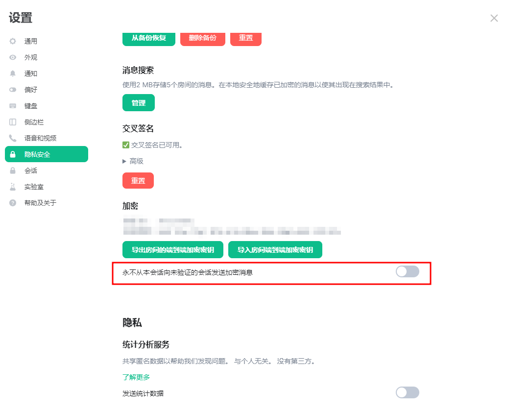
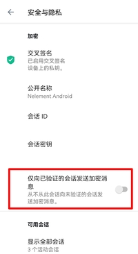

# 设备密钥管理

本章里将会介绍两个概念，设备和密钥的管理。

## 威胁模型

为什么交叉签名和设备验证如此重要？

Matrix协议的设计理念中有一个非常重要的概念，那就是服务器不可信——你可以想象成，服务器和运营Matrix网站的人可能希望破解你的账户/密码，获得您的聊天记录，并伪装成您给对方发送消息，而客户端必须想办法尽可能阻止这种事情的发生。

虽然我们承诺NerChat!相当安全，你们的数据完全受到保护，我们也绝对不会获取你们的密码并进行非法登录之类的操作，但是我们的保证并不能被你们信任——换句话说，服务器和运营方是完全不可信的，您完全有资格怀疑我们的安全性。这也是Matrix协议要解决的问题——怎么在服务器不受信任的前提下建立信任可靠的消息通道。

客户端面临的主要威胁有三个。

### 中间人攻击

服务器可以在客户进行交换密钥验证的过程中进行中间人攻击。网络上有相当多的资料介绍什么是[中间人攻击](https://www.jianshu.com/p/9742ece54ded)，这里不再赘述。

### 假冒登录

服务器可以利用客户端的密码进行客户端未授权的登录，创造新的设备与您的朋友互相发送消息。服务端甚至可以做得完全不留下任何的痕迹，甚至都不需要知道您的明文密码。

关于这一点，服务器能做的事情甚至更多，服务器可以直接登录一个账号，并混进这个账号已经加入的其中一个群组里监听其他人的加密聊天。

### 破解密钥库

如果客户端对自己的密钥库的加密不够严密（比如使用和密码相同的安全短语），服务器甚至可以解密客户端的所有加密聊天内容。

对于这三点来说，一个强验证的Matrix聊天网络是完全可以规避这些问题的。

- 对于破解密钥库攻击的手段，强烈建议客户端不要将自己的登录密码和密钥库的安全短语设为同一个。时刻记住——您的登录密码对服务器来说是完全不加密的。
- 对于中间人攻击和假冒登录的手段，客户端需要互相建立可靠的验证交叉验证签名，客户端之间通过识别签名，来保证参与自己对话不会泄露，保证对话的完全安全。

服务器当然可以登录您的账号，但如果服务器无法解密您的Megolm密钥库，它将无法伪造成您的设备，它只能把自己变成一个新设备，这个设备的公钥必然不会经过信任您的人的交叉签名。

我们首先解释一下这是为什么——为什么服务器不能用您已经广播的公钥来伪装自己？因为服务器没有这个公钥对应的私钥！私钥保存在您的Megolm密码库中，服务器无法获取。利用这一点，一个相当坚实的认证体系的作用就体现出来了——服务器无法伪装成对方来获得您朋友的信任。

如果一个本来安全的聊天里，突然有一个设备不受信任了，您的朋友可以以其他方式向您确认这一现象，这样就可以轻易的发现中间人的存在了。当然如果不方便联系您本人，您的朋友还可以向这个不安全的设备来直接提问来确认这个设备是否为您本人持有，这些细节都在各种意义上暴露服务器的所作所为。

因此，如果您真的不信任NerChat!的服务器，请务必注意自己的朋友的设备的验证情况。当然，如果对方使用的设备并没有您的签名，您的软件也会向您发送提醒的。

## 登录设备管理

客户端可以随时查看自己登录了多少设备，同时下线自己从未登录过的设备。用户在一个新设备上登录后，需要提供安全密钥来获得密码库，解密自己的加密聊天记录，同时让自己的设备快速获得信任——密码库里有其他人对您公钥的签名，这些签名是您获得信任的关键。如果一个设备不能获得这些密码库，它还有一种快速的方法来让其他人信任自己——获得您的签名。如果有人使用您的密码在您未允许的情况下登录您的账号，它无法获得您的密码库和签名，也就无法获得其他设备的信任。在其他设备看来，这个设备的表示就表示为红色或者灰色，表示不可信任。

您可以随时管理您的登录设备。您可以任意下线其中的任何设备，清除它们在服务器中的登录状态，这个操作可以作为您在意外在不受信任的平台上登录了账号之后的补救措施——这些平台往往都是Web。您放心，受限于安全政策，Web端不会将您的密码库保存到永久存储中，虽然这会造成一定的不便，但您不用担心自己密钥的泄露问题。

::: tabs

== Web

设置->会话

== Mobile

设置->安全与隐私->可用会话

:::

## 恢复备份的密钥库

因为一些原因，您的设备可能会丢失一些自己的密钥，这将导致您无法解密一些消息记录。通常这种情况可以通过一个简单的恢复密钥的操作来完成。客户端会重新向服务器请求下载自己经过加密的Megolm密钥库备份，然后您需要提供自己的安全密钥来解密这个密钥库，在这之后，客户端会将自己现有的密钥库和解密成功的密钥库备份合并，并将其用相同的密钥加密后重新备份到服务器。这个过程叫做“恢复密钥库备份”，可以通过简单的操作来完成。

## 从不向未验证的设备发送加密消息

既然任何没有持有您信任的交叉验证公钥的设备都有可能是服务器安排的中间人“间谍”，那么您当然可以拒绝信任任何未验证的用户，拒绝与他们进行加密沟通，这个选项可以在客户端中打开。当启用此功能后，每个加密聊天在建立之前，您的客户端都会检查对方的交叉验证签名，如果发现这个签名不受自己信任，则会要求您先与对方完成交叉验证。

这会对聊天软件的正常使用造成很大的不便，而且NerChat!已经承诺了服务器的安全性，不会做自砸招牌的事情，所以您完全没有必要这么做。如果您确实需要与某人交流高度密级的消息，直接验证它的设备就可以，不需要严格限制自己的聊天对象的交叉验证。

不过您还是可以打开这个选项，打开方法如下。

::: tabs

== Web

点击头像->所有设置->隐私安全->加密->永不从本会话向未验证的会话发送加密消息

== Mobile

点击头像->安全与隐私->仅向已验证的会话发送加密消息

:::