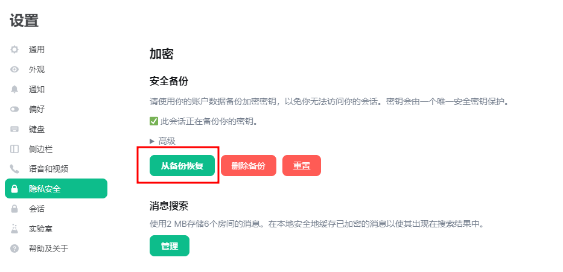

之前我们已经在“安全密钥”一章里介绍过了云端备份密钥库的方法。云端备份密钥库的特点就是非常方便，可以快速让新设备获得所有历史聊天记录。但密钥库毕竟备份在服务器，并不掌握在您自己的手中，您可能还是会觉得不放心，同时虽然我们承诺不会对您的密钥做任何的操作，但您还是觉得服务器的拥有者可以随时删除您的密钥备份，非常不安全。为了最大限度的保护您的历史密钥，您完全可以将它导出在本地，并在需要的时候恢复其中的内容。

当然，服务器的拥有者还是可以气急败坏的删除您的所有加密历史聊天记录。如果您真的很在意自己的历史聊天的价值，请导出自己的聊天记录到本地。

::: warning

NerChat!并不承诺会永久保留您的聊天消息历史记录，甚至我们不会承诺永久保留您的账号——虽然我们承诺我们会尽全力。所以请您不要将NerChat!当作数据仓库或网盘来使用。如果您有非常想要保留的聊天记录，请将其导出到本地。

:::

## 恢复密码库

在“安全密钥”一章中，您已经知道应该如何将自己的Megolm密码库加密后上传到服务器备份，在本节，我们将介绍如何从服务器中下载并恢复这个密码库。

::: tabs#client

@tab Web

头像->隐私安全->安全备份->从备份恢复

@tab Mobile

设置->安全与隐私->恢复已加密消息->从备份恢复

:::

## 导出导入端到端房间密钥

您除了可以上传密钥库到服务器，您还可以在本地导出保存密钥库，方法如下：

::: tabs#client

@tab Web

头像->隐私安全->安全备份->导出房间的端到端加密密钥->输入并确认口令词组->保存

这里输入的口令词组只是用来加密导出的密钥的，你在导入密钥库的时候需要提供这个词组。

Web端和移动端的密钥库是通用的。

@tab Mobile

设置->安全与隐私->导出端到端房间密钥->选择导出位置->输入并确认口令词组->完成

这里输入的口令词组只是用来加密导出的密钥的，你在导入密钥库的时候需要提供这个词组。

Web端和移动端的密钥库是通用的。

:::

导入的过程就是选择“导入密钥”就可以，需要提供在导出密钥时提供的密码。

