# 安全密钥

::: warning

**\*注意，本章内容非常重要，所有NerChat!的用户必须掌握本章的内容。**

:::

::: warning

不要将登录密码和加密密钥混为一谈，登录密码仅仅作为限制用户登录的一层屏障，这个密码可以轻易被管理员获得！而除非您将安全密钥设置得很弱，否则管理员永远无法获取您已经广受信任的加密密钥，所以请务必设置强安全密码保护您的密钥库！

:::

## 房间密钥库与安全密钥

Matrix中的每个用户加入的每个房间都会在用户本地存储一个密钥，这是加密聊天的基础。除此之外，Matrix还需要保存很多额外的用户密钥信息，这些密钥共同保证了用户可以在不同的加密房间中正常聊天。但如果用户更换了新设备，而正好又没有将原来的密钥一起带过来，就会导致无法解密之前的聊天信息，造成极大的困扰和不便。因此，为了在保证安全的前提下，增强Matrix系统和软件的易用性，Matrix服务器支持用户将庞大的密钥库和设备密钥等信息，在本地加密后上传到服务器中，让服务器代为保管。用户想要取用时，Element客户端从Matrix服务器下载到密钥库，用户只需要提供正确的 **安全密钥** 或 **安全短语** ，就可以获取密钥库的所有内容，进而解密服务器数据，获得完整的房间历史数据。因此即使客户端的数据完全丢失，仅凭正确的 **安全密钥** 或 **安全短语** 也可以完全恢复聊天内容。在Element客户端中， **安全密钥** 表现为12个4字单元的组合，它可以由 **安全短语** 计算得出，也可以随机生成。

**安全密钥** 是你在Matrix世界中的“钥匙”和“身份证”，重要性不言而喻。因此当用户初次登录后， **强烈建议** 用户立即导出安全密钥，并将其妥善保管，方便自己未来的使用。安全密钥本身强度较高，可以认为得到了安全密钥就掌握了整个房间密码库。下面的示意图供参考：

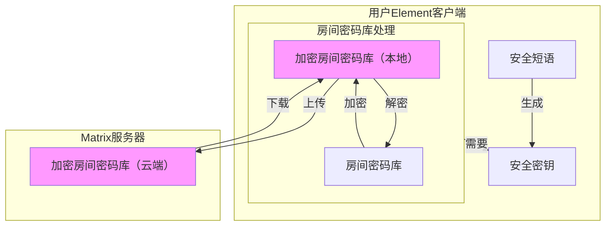

::: danger

保护您的安全密钥**非常重要**！

一旦安全密钥丢失，你将彻底丢失自己的加密群组消息。

一旦安全密钥泄露，拥有服务器数据的人将能够获得您加入的加密群组中的**所有**你能看到的消息！

:::

您还可以选择直接导出整个房间密码库，这虽然麻烦一些，但不需要从服务器下载庞大的房间密码库，比较方便在各个设备中离线同步。当您的新设备无法解密房间历史消息，在等待消息解密时，可以通过这种方法加速消息的解密，详情可以参考[协议](protocol)。

## 生成并导出安全密钥

在您首次登录后，需要尽快导出自己的密钥，以便您可以在新的设备上加载此密钥，来继续使用之前的加密会话。具体的操作方法如下：

::: tabs

== Web

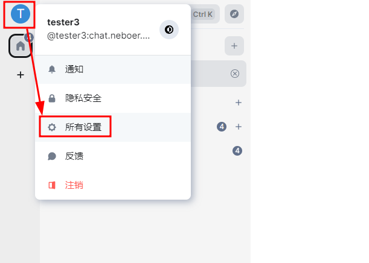

1. 点击头像，打开设置选项。

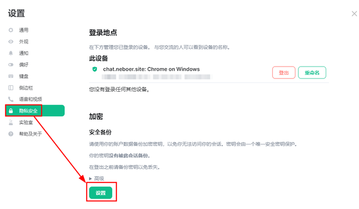

2. 在打开的设置界面中，选择“隐私安全”，然后在右侧的“安全备份”下点击“设置”按钮。

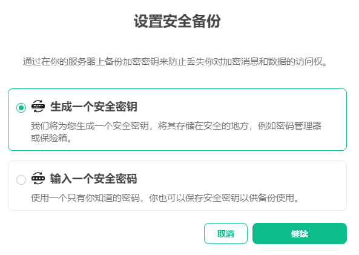

3. 弹出的菜单会询问您要如何保存密钥。
    - 如果选择“生成一个安全密钥”，客户端会直接给您生成一个密钥文件供您使用。
    - 如果选择“使用一个安全密码”，客户端会基于您提供的密码来生成这个密钥文件。

    两种方法都可以，没有孰优孰劣之分。使用密码导出密钥更加方便，但直接生成密钥则更加安全。理论上来说，两种方法都可以有效的保护您的加密消息。
    因此NerChat!更推荐用户使用一个自己可以记住的、足够长度的密码来保存密钥，这个密码被称为==安全短语== 。

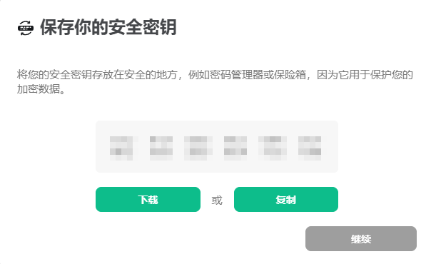

4. 在弹出的菜单里选择下载密钥或复制密钥到一个空文件中，把生成的密钥保存起来，然后点击继续，完成整个流程。

== Mobile

1. 在移动端注册并首次登录后，点击用户头像打开设置。

  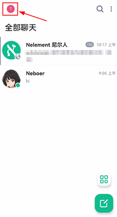
  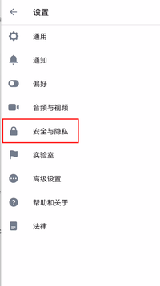
  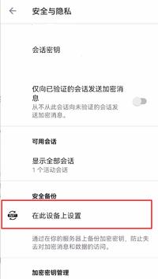

2. 在设置中找到“安全与隐私”，点击。

3. 找到“安全备份”选项组，点击“在此设备上设置”。

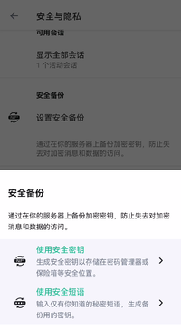

4. 如果你确实是首次在此设备上登录，那么“安全备份”会直接弹出。弹出的菜单会询问您要如何保存密钥。
    - 如果选择“生成一个安全密钥”，客户端会直接给您生成一个密钥文件供您使用。
    - 如果选择“使用一个安全密码”，客户端会基于您提供的密码来生成这个密钥文件。

    两种方法都可以，没有孰优孰劣之分。使用密码导出密钥更加方便，但直接生成密钥则更加安全。理论上来说，两种方法都可以有效的保护您的加密消息。
    因此NerChat!更推荐用户使用一个自己可以记住的、足够长度的密码来保存密钥，这样就不必在反复切换设备的过程中反复验证了，直接输入密码就可以。

5. 当你完成保存之后，会出现一个“继续”按钮。点击此按钮结束密钥备份操作。

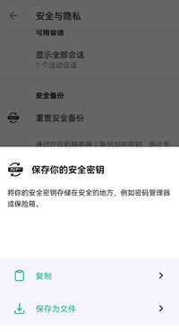

:::

这样一来，密钥就成功的导出在您本地文件中了，请妥善保管您的密钥！

## 加载安全密钥

当您在新的设备上登录后，新的设备会向服务器请求并下载经过加密的密钥库，此时需要您提供正确的安全密钥或者安全短语来解密房间密码库，以便正常显示您的聊天记录。

::: tabs

== Web

1. 当您在一个全新的Web端登录一个已经注册并且导出了安全密钥（即完成了生成并导出安全密钥的操作）的账号的时候，在输入账号密码点击登录之后，系统会要求您提供安全密钥。

    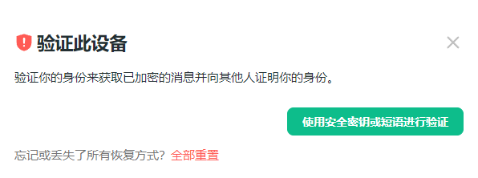

    如果你还有其他设备可以登录账号，也可以**使用其他设备进行验证**，就不需要手动输入安全短语或者选择密钥文件了。

    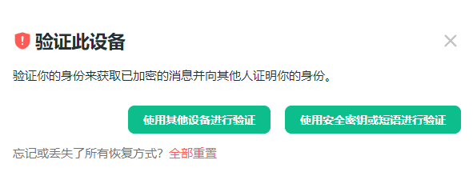

2. 点击“使用安全密钥或短语来验证”，就可以输入您在最开始登录时设置的==安全短语==。

    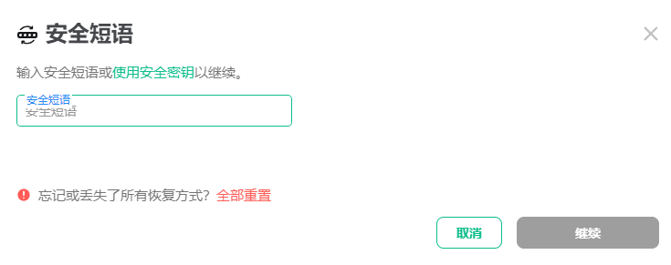

    或者，如果您一开始设置的是安全密钥，可以点击“使用安全密钥”切换到输入安全密钥的模式，然后上传之前导出的安全密钥文件，或者将文件的内容（4*12个字符）直接拷贝到左侧的输入框中。

    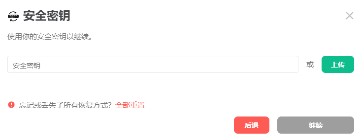

    当然，如果你丢失了密钥，也不再想要保留自己过去的聊天记录了，可以直接就地重置自己的密钥。重置密钥后，你需要重新导出自己的加密密钥。

    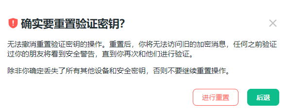

    如果您重置了自己的密钥，您的其他正常登录的设备会收到警告，提示有一个设备重置了自己的密钥，并提醒你可能存在潜在的盗号风险。如果你在没有任何密钥备份的前提下重置了自己的密钥，那么你将永远无法获得之前的聊天记录了。

    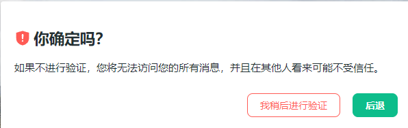

    如果你按了“X”尝试关闭对话框，那么客户端会提醒你跳过验证的后果：无法访问历史消息、设备不受其他人信任。如果现在不方便输入密钥，你可以点击“我将稍后进行验证”，你会继续正常进入系统和其他人聊天，但是系统会提示您尽快验证。

3. 当你输入正确的==安全短语==或者提供了正确的安全密钥之后，客户端会自动验证成功，此时你就可以访问之前所有的加密消息了。

    ::: info

    如果你备份了房间密码库，那么你大可直接跳过这个提供安全密钥的环节，而换成直接导入房间密码库。
    但是注意房间密码库在设备之间交换非常困难，需要频繁的导入导出，相当不方便，因此并不推荐使用这种方法。

    :::

    ::: info

    如果你没有提供安全密钥，那么您将不能访问您的加密消息。在Web端，具体表现为无法阅读之前自己发送和收到的加密消息，如图所示。

    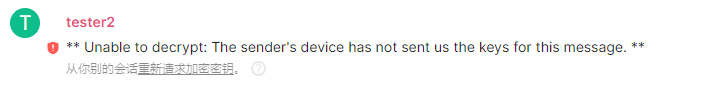

    如果你提供了密钥但依然遇到了这个问题，请稍等片刻再检查。如果等待了很长时间依然不能解密消息，请参阅[帮助](../help/faq#我不能解密聊天记录)部分。

    :::

== Mobile

当您在移动端设备登录后，如果之前您已经导出了密钥，那么顶部会出现提示“验证此设备”。当您点击之后，它会要求您“使用恢复口令或密钥”，如果您还有其他登录着NerChat!账号的客户端，您还可以通过这些已经登录了账号的客户端来认证这个新设备，如第二张图所示的那样。

  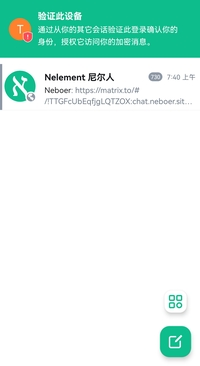
  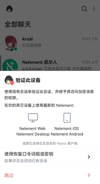
  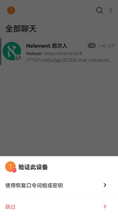

- 如果您身边有已经认证的设备，同时您不想输入安全密钥，那么您可以使用那个设备来认证当前登录的会话，密钥会在非对称加密之后通过NerChat!由一个设备分享给另一个设备。具体步骤如下：

    1. 此时您已经登录的设备会弹出提示，询问您是否同意此设备的验证请求。里面会提供这个设备客户端的名称、ip地址。您点击“接受”，尝试开始与客户端的认证。

        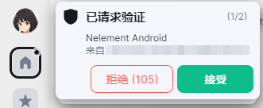
    
    2. 弹出的窗口中会询问你想使用何种方式验证——扫描二维码或者使用表情符号。如果您手机有摄像头，推荐使用二维码的方法验证。如果您不方便使用二维码验证，可以用表情符号，遵照提示进行验证就可以。

    3. 完成验证后，双方互相确认，就可以完成整个过程了。

        

            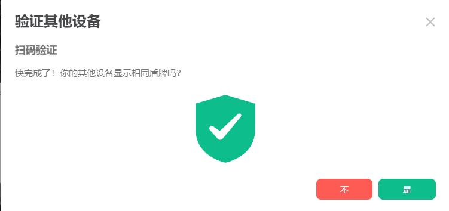
            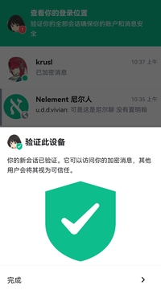
        

- 如果您没有条件认证设备，也可以输入安全短语或提供安全密码来完成验证。具体步骤如下：

    1. 点击“使用恢复口令词组或密钥”按钮，在弹出的对话框中输入自己的==安全短语==。或者如果您没有使用安全短语来保存密钥，您可以上传自己的安全密钥，或粘贴其中的内容。两种模式的切换可以通过点击“使用恢复密钥”和返回键来实现。

    

        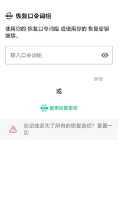
        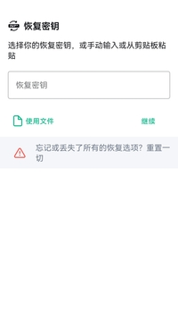
    

    2. 客户端会开始计算密码，如果密码正确，那么客户端会提示“认证成功”。点击“完成”结束验证过程。

    

        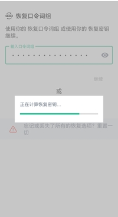
        
    

    ::: info

    如果你备份了房间密码库，那么你大可直接跳过这个提供安全密钥的环节，而换成直接导入房间密码库。
    但是注意房间密码库在设备之间交换非常困难，需要频繁的导入导出，相当不方便，因此并不推荐使用这种方法。

    :::

    ::: info

    如果你没有提供安全密钥，那么您将不能访问您的加密消息。在移动端，具体表现为无法阅读之前自己发送和收到的加密消息，如图所示。

    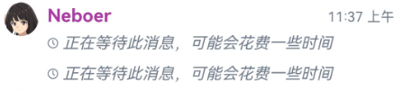

    如果你提供了密钥但依然遇到了这个问题，请稍等片刻再检查。如果等待了很长时间依然不能解密消息，请参阅[帮助](../help/faq)部分。

    :::

:::

需要注意的是，在您输入安全密钥之后，您不会立刻获得所有的加密聊天记录。您需要等待服务器将聊天记录和加密的密钥发送完毕后才能解密全部的聊天记录，这取决于您和服务器的网络环境，一般等待的时间不会超过1分钟。而如果您不是通过输入安全密钥，而是通过其他设备进行的认证，那么您可能无法解码部分历史聊天记录。为解决这个问题，您可以尝试恢复历史密钥，如果您之前导出过加密房间的密钥库，您还可以从以前的备份中恢复密钥。具体的操作详见[密钥备份与恢复](local-backup)。